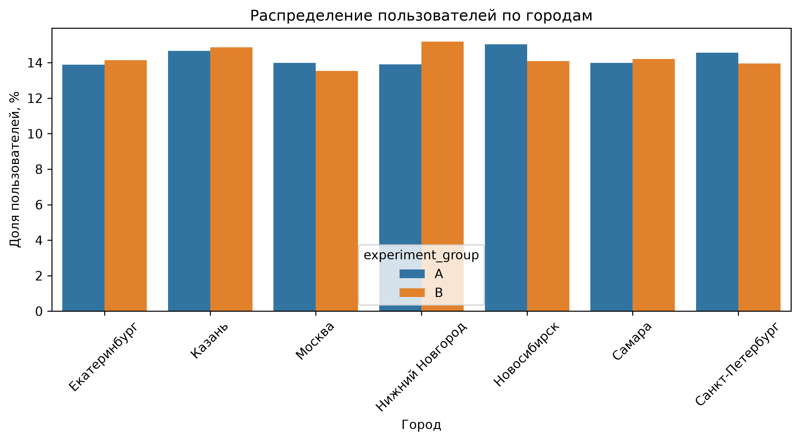
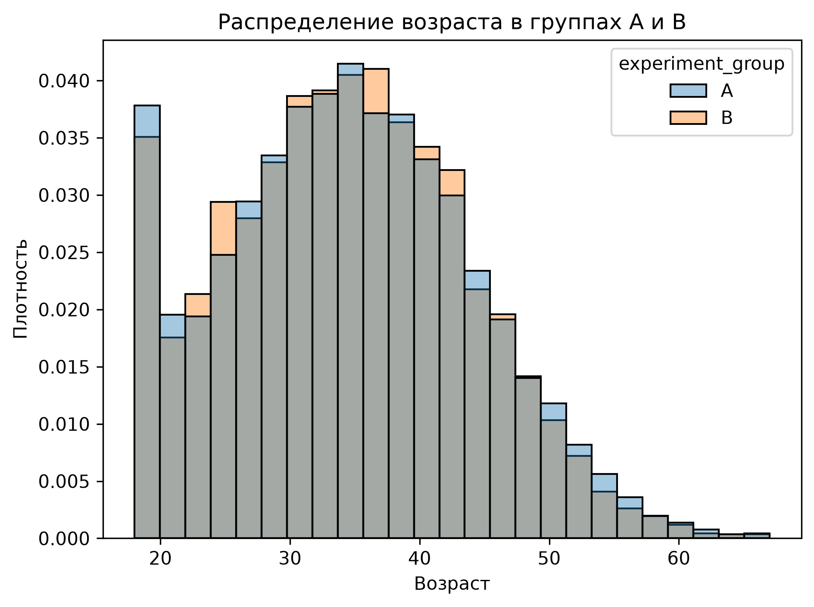
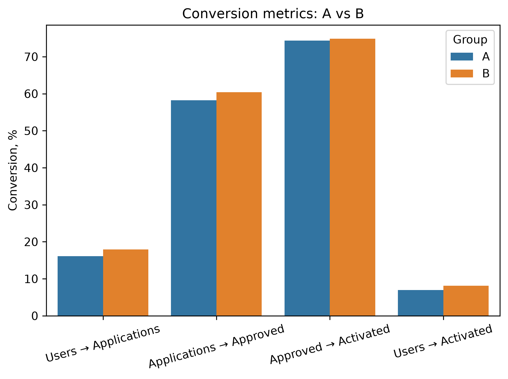
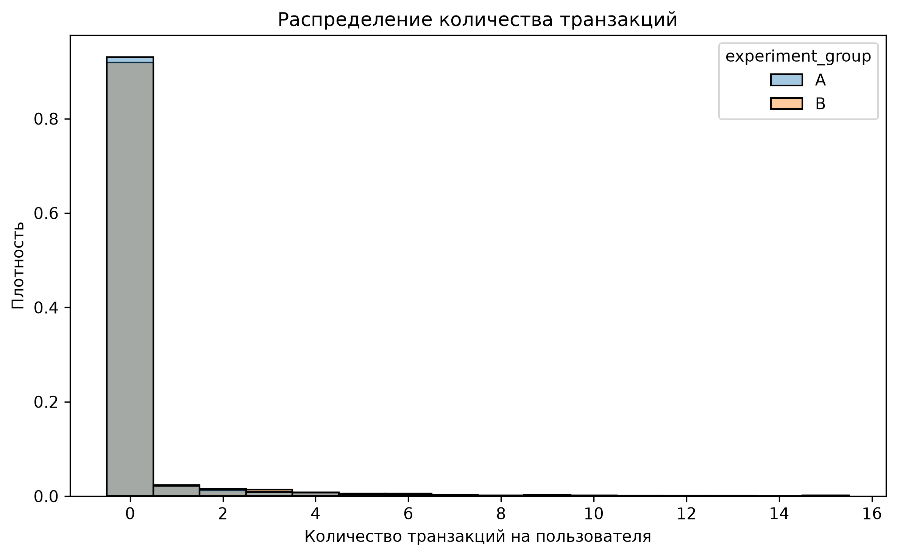
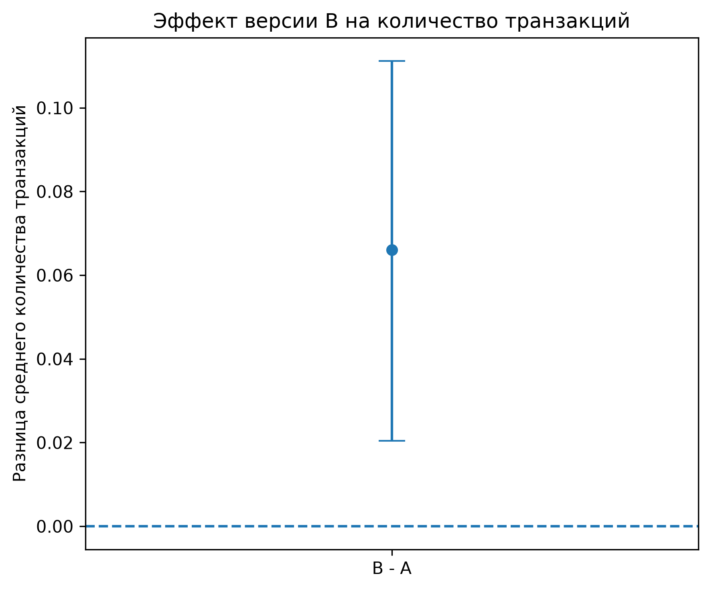
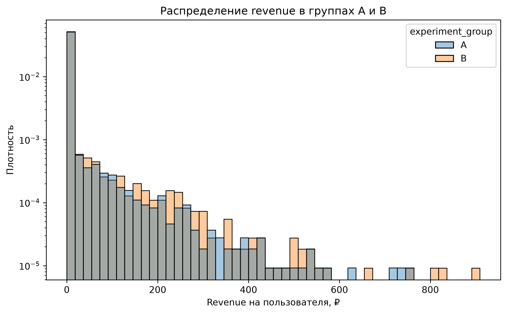
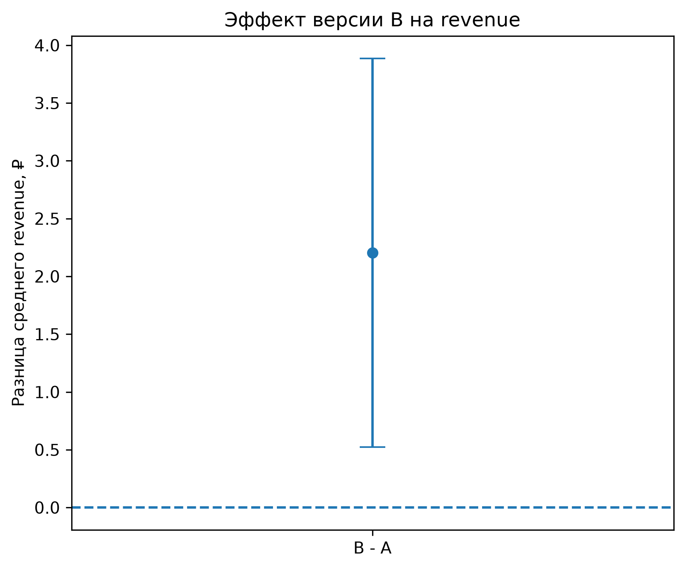
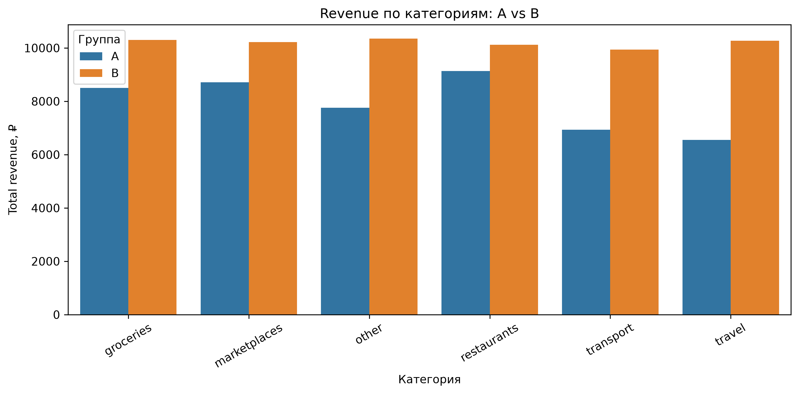
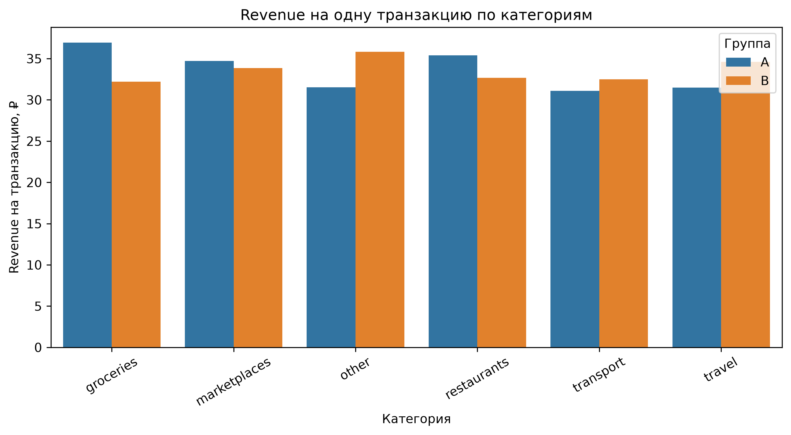
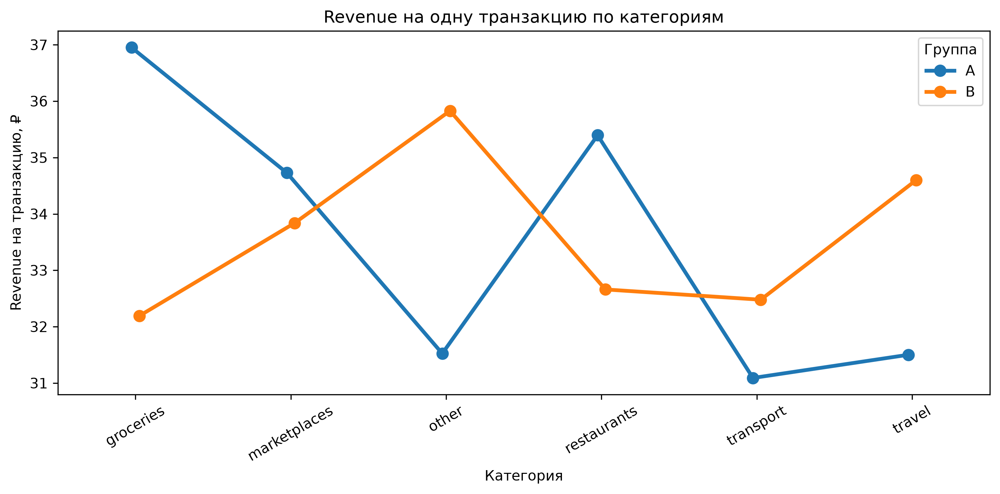

# A/B Test Analysis — Banking Product

## О проекте

Проект посвящён анализу результатов A/B-теста банковского продукта.

Пользователи были разделены на две группы:

- **A** — контрольная группа;
- **B** — тестовая группа.

Цель анализа — определить, повлияла ли тестовая версия продукта на прохождение пользователями воронки, транзакционную активность и доход банка.

В анализе используются **SQL** для подготовки и агрегации данных и **Python** для статистического анализа и визуализации результатов.


## Основные задачи

В рамках проекта были выполнены:

1. Проверка баланса экспериментальных групп.
2. Анализ продуктовой воронки.
3. Анализ количества транзакций на пользователя.
4. Анализ revenue на пользователя.
5. Анализ revenue среди пользователей с положительным доходом.
6. Анализ транзакций и revenue по категориям.


## Структура проекта

```text
bank_ab_test/
├── analysis/
│   ├── 01_funnel_analysis.py
│   ├── 02_balance_analysis.py
│   ├── 03_transaction_analysis.py
│   ├── 04_revenue_analysis.py
│   └── 05_categories_analysis.py
│
├── data/
│   ├── raw/
│   │   ├── users.csv
│   │   ├── experiment.csv
│   │   ├── applications.csv
│   │   ├── transactions.csv
│   │   └── sessions.csv
│   └── processed/
│       ├── funnel.csv
│       ├── city.csv
│       ├── device.csv
│       ├── age.csv
│       ├── user_metrics.csv
│       └── categories.csv
│
├── images/
├── sql/
├── .gitignore
├── requirements.txt
└── README.md
```


## Используемые технологии

- **SQL / PostgreSQL** — подготовка и агрегация данных;
- **Python**
- pandas
- NumPy
- SciPy
- statsmodels
- Matplotlib
- Seaborn


# 1. Проверка баланса групп

Перед анализом результатов эксперимента была проведена проверка сопоставимости групп A и B по исходным характеристикам пользователей.

Проверялись:

- город;
- устройство;
- возраст.

Для категориальных признаков `city` и `device` использовался **χ²-критерий Пирсона**.

Гипотезы:

**H0:** распределение признака не зависит от экспериментальной группы.

**H1:** распределение признака зависит от экспериментальной группы.

Для возраста использовался **t-критерий Уэлча**:

**H0:** средний возраст пользователей групп A и B одинаков.

**H1:** средний возраст пользователей различается.

### Распределение по городам



### Распределение по устройствам



### Распределение возраста


# 2. Анализ воронки

Исследовалась следующая продуктовая воронка:

```text
Users
  ↓
Applications
  ↓
Approved
  ↓
Activated
```

Для сравнения конверсий между группами использовался **двухвыборочный z-тест для долей**.

Для промежуточных этапов применялась **поправка Бонферрони** для контроля ошибки при множественных сравнениях.

Основной метрикой эксперимента является конверсия:

**Users → Activated**

Также отдельно анализировались:

- Users → Applications;
- Applications → Approved;
- Approved → Activated.



Результаты показывают, что статистически значимое различие появляется уже на этапе **Users → Applications**.

На последующих переходах **Applications → Approved** и **Approved → Activated** статистически значимых различий обнаружено не было.

При этом итоговая конверсия **Users → Activated** в группе B выше, чем в группе A.


# 3. Транзакционная активность

Следующим этапом анализировалось среднее количество транзакций на одного участника эксперимента.

Результаты:

| Метрика | A | B |
|---|---:|---:|
| Среднее количество транзакций | 0.237 | 0.303 |

Абсолютная разница:

**+0.066 транзакции на пользователя**

Относительный uplift:

**+27.87%**

Для проверки гипотезы использовался **t-критерий Уэлча**.

Получено:

```text
t = -2.862
p-value = 0.004214
```

Так как `p-value < 0.05`, нулевая гипотеза отвергается.

Различие среднего количества транзакций между группами является статистически значимым.

Дополнительно был построен 95% bootstrap-доверительный интервал для разницы средних:

```text
95% CI ≈ [0.02; 0.11]
```

Интервал не содержит ноль, что также подтверждает положительный эффект версии B.

### Распределение транзакций



### Оценка эффекта




# 4. Анализ revenue

Для каждого пользователя был рассчитан суммарный доход банка (`sum_revenue`).

Средний revenue:

| Группа | Mean revenue |
|---|---:|
| A | 7.96 ₽ |
| B | 10.16 ₽ |

Абсолютный эффект:

**+2.20 ₽ на пользователя**

Относительный uplift составляет примерно:

**+27.7%**

Для сравнения средних использовался **t-критерий Уэлча**.

Получено:

```text
t ≈ -2.53
p-value ≈ 0.0113
```

При уровне значимости 5% различие является статистически значимым.

95% bootstrap-доверительный интервал для разницы средних составляет приблизительно:

```text
[0.49; 3.91] ₽
```

Интервал полностью находится выше нуля.

### Распределение revenue



### Эффект B на revenue




## Revenue среди пользователей с положительным доходом

Дополнительно отдельно анализировались только пользователи с:

```text
sum_revenue > 0
```

Средние значения:

| Группа | Пользователей | Mean revenue |
|---|---:|---:|
| A | 417 | 114.12 ₽ |
| B | 488 | 125.44 ₽ |

Несмотря на более высокое среднее значение в группе B, статистически значимого различия обнаружено не было:

```text
p-value ≈ 0.189
```

Это позволяет предположить, что рост общего revenue на пользователя связан в значительной степени с увеличением доли пользователей, которые начинают совершать доходные для банка операции, а не только с увеличением revenue среди уже монетизирующихся пользователей.


# 5. Анализ категорий

Для более подробного изучения механизма изменения revenue были проанализированы категории транзакций.

### Total revenue

| Категория | A | B | Uplift |
|---|---:|---:|---:|
| travel | 6552.30 | 10275.70 | +56.83% |
| transport | 6933.18 | 9938.32 | +43.34% |
| other | 7754.87 | 10354.30 | +33.52% |
| groceries | 8498.77 | 10301.10 | +21.21% |
| marketplaces | 8716.69 | 10219.30 | +17.24% |
| restaurants | 9131.89 | 10124.70 | +10.87% |



Total revenue в группе B выше во всех рассматриваемых категориях.

Наибольший относительный рост наблюдается в:

- **travel: +56.83%**
- **transport: +43.34%**
- **other: +33.52%**


## Количество транзакций

Рост количества транзакций также наблюдается во всех категориях.

Наиболее сильный относительный рост:

- travel: **+42.79%**
- groceries: **+39.13%**
- transport: **+37.22%**




## Revenue на одну транзакцию

Дополнительно была рассчитана метрика:

```text
revenue_per_transaction =
total_revenue / count_transactions
```



Рост total revenue не во всех категориях связан с увеличением дохода с одной транзакции.

Например, в категории `groceries`:

- количество транзакций: **+39.13%**;
- revenue на транзакцию: **−12.88%**;
- total revenue: **+21.21%**.

Следовательно, рост total revenue в этой категории объясняется прежде всего увеличением количества транзакций.

В категории `travel` наблюдаются одновременно:

- рост количества транзакций: **+42.79%**;
- рост revenue на транзакцию: **+9.83%**;
- рост total revenue: **+56.83%**.

Категориальный анализ является описательным: статистические тесты по отдельным категориям не проводились, поскольку используемый датасет агрегирован на уровне группы и категории.


# Итоговые выводы

Результаты A/B-теста указывают на положительный эффект версии B.

Основные результаты:

- версия B улучшает итоговую конверсию в активацию карты;
- основное различие в воронке возникает на этапе **Users → Applications**;
- среднее количество транзакций на пользователя увеличилось примерно на **27.9%**, различие статистически значимо;
- средний revenue на пользователя вырос примерно с **7.96 ₽ до 10.16 ₽**;
- прирост среднего revenue составляет около **2.20 ₽ на пользователя** и является статистически значимым;
- среди пользователей с положительным revenue статистически значимого различия среднего revenue не обнаружено;
- рост total revenue наблюдается во всех рассмотренных категориях;
- наиболее сильный рост наблюдается в категориях `travel` и `transport`;
- рост revenue во многих категориях объясняется прежде всего увеличением транзакционной активности пользователей.

## Рекомендация

На основании полученных результатов вариант **B может быть рекомендован как более эффективный** по ключевым продуктовым и финансовым метрикам.

При принятии окончательного решения также следует учитывать стоимость внедрения тестовой версии, бизнес-ограничения и практическую значимость наблюдаемого эффекта.


# Запуск проекта

Клонировать репозиторий:

```bash
git clone https://github.com/IvanReznya/bank_ab_test.git
cd bank_ab_test
```

Установить зависимости:

```bash
pip install -r requirements.txt
```

Запустить анализы:

```bash
python analysis/01_funnel_analysis.py
python analysis/02_balance_analysis.py
python analysis/03_transaction_analysis.py
python analysis/04_revenue_analysis.py
python analysis/05_categories_analysis.py
```
